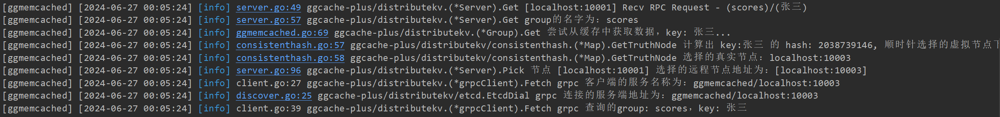

# Distributed_KV_Store

## 项目介绍

仿照groupcache框架，实现一个支持 HTTP、RPC 和服务注册发现的分布式kv缓存系统（Linux运行）

支持高可用的服务注册发现

支持动态节点管理和网络拓扑快速收敛的分布式键值缓存系统

## 功能介绍

v1.0

- 支持 RPC （遵循 gRPC 框架）
- 支持多种缓存淘汰策略灵活替换（LRU、LFU、FIFO）
- 支持服务注册发现（etcd cluster）
- 支持从 etcd 获取服务节点信息
- 支持全局日志处理
- 支持负载均衡和并发访问控制
- 提供了自动化测试脚本

v2.0

- 增加 TTL 机制（ 单独一个 goroutine），自动清理过期缓存
- 使用 endpoint manager 和 watch channel 实现类似于服务订阅发布的能力
- 使用类似于事件回调的处理机制，根据节点的 PUT、DEL 事件更新节点状态
- 实现秒级节点之间拓扑结构的快速收敛（动态节点管理）
- 增加 grpc client 测试重试逻辑
- 增加缓存穿透的防御策略（将不存在的 key 的空值存到缓存中，设置合理过期时间，防止不存在的 key 的大量并发请求打穿数据库）

## 功能优化方向（todo）

1. 添加缓存命中率指标（动态调整缓存容量）
2. 增加请求限流（令牌桶算法）
3. 增加 ARC 缓存淘汰算法、LRU算法升级
4. 现缓存和数据库的一致性（增加消息队列异步处理）（也可以通过缓存淘汰时的回调函数实现）

...

## 项目结构

```
.
├── config									// 日志、mysql、etcd、ggroupcache配置
├── core									// 读取配置文件，配置logrus、gorm和etcd
├── distributekv							// 分布式键值存储系统
│   ├── byteview.go							// 一个只读的数据结构，表示缓存值
│   ├── cache.go							// 支持缓存淘汰策略的底层缓存
│   ├── consistenthash						// 一致性 hash 算法（负载均衡）
│   ├── etcd
│   │   ├── cluster							// etcd 3 节点集群
│   │   ├── discover.go						// 服务发现
│   │   └── register.go						// 服务注册
│   ├── ggroupcache.go						// 对底层缓存的封装（资源隔离、并发安全）
│   ├── group.go							// 测试用的数据库和缓存数据
│   ├── grpc								// 节点间grpc通信
│   │   ├── client.go						// grpc服务端
│   │   ├── ggroupcachepb					// gRPC protobuf
│   │   └── server.go						// grpc客户端
│   ├── http								// 节点间http通信
│   │   ├── client.go						// http客户端
│   │   ├── http_helper.go
│   │   └── server.go						// http服务端
│   ├── peers.go							// 节点相关接口
│   ├── policy								// 缓存淘汰策略
│   │   ├── enter.go
│   │   ├── fifo.go
│   │   ├── lfu.go
│   │   ├── lru.go
│   │   ├── priority_queue.go
│   └── singleflight						// 并发请求处理优化（防止缓存击穿）
├── flags									// 命令行参数
├── global									// 全局变量
├── go.mod
├── go.sum
├── grpc_client.go							// 节点间grpc通信测试
├── log										// 日志
├── main2.go								// 节点间http通信main
├── main.go									// 节点间grpc通信main
├── models									// 数据库数据模型
├── README.md
├── resources								// 图片资源
├── scripts									// 自动化测试脚本
│   ├── http								// 节点间http通信测试脚本
│   ├── readme.md
├── settings.yaml							// 配置文件
├── testdata								// 普通测试函数
└── utils									// 工具函数
```


## 使用

1、启动 etcd 集群

进入 /etcd/cluster 目录，分别运行

```bash
cd distributekv/etcd/cluster
```

```bash 
go install github.com/mattn/goreman@latest
```

```bash
goreman -f Procfile start
```


查看成员状态


2、启动服务节点

```bash
# 开三个终端分别执行：
go run main.go -port 10001
go run main.go -port 10002
go run main.go -port 10003
```

- 后端数据库、缓存初始数据写入成功 


在秒级获取到节点信息变化，快速收敛

现在服务启动成功，可以执行grpc_client.go（开一个新的终端）：

```bash
go run grpc_client.go
```


## 执行日志分析

定义：

- 第一个节点（localhost:10001）；
- 第二个节点（localhost:10002）；
- 第三个节点（localhost:10003）；

### 缓存未命中（用的原作者的图）


> 第一个 RPC 请求到达后，第二个节点（localhost:10000）接收到，一致性 hash 模块计算 key 的 hash 值，得到 2453906684 ，然后去哈希环上顺时针找大于等于这个 hash 值的首个虚拟节点，找到了哈希环上的第 74 个节点（对应下标 idx=73）；然后再去查虚拟节点和真实节点的映射表，发现这个虚拟节点对应的真实节点正是第二个节点（localhost:10000）；即由该节点负责处理这个 RPC 请求，因为缓存中还没有这个 key 的缓存，所以需要从数据库中查询，然后将查询结果写入缓存，并返回给客户端。（对照日志输出理解）

### 请求转发



> RPC 请求由第一个节点（localhost:10001）接收到，一致性 hash 模块计算后将 key 打到了第三个节点上（localhost:10003），第一个节点将请求转发给第三个节点处理（pick remote peer）。

查看第三个节点日志，发现它收到了来自第一个节点的转发请求。


日志内容很详细：收到转发的请求、根据一致性 hash 算法计算出真实节点（发现就是自己）、从后端数据库查询 'key=张三' 的值，返回 333、最终客户端收到 RPC 响应；


### 缓存命中

我们已经将 'key=张三' 的成绩存入到节点 3 的缓存中了，按照正常处理逻辑，下一次查询时应该先转发到节点3，然后在 节点3 上走缓存而不是慢速数据库，我们再发起一次请求：


根据日志输出可知：一致性 hash 算法将相同的 key 打到了相同的节点上（一致性 hash 算法有效），同样的，节点 1 成功将 RPC 请求转发给了节点 3（分布式节点集群通信正常）；

最后我们还需要验证一下节点 3 的缓存是否生效：

节点 3 的日志：


### 清理过期缓存


## 节点间采用http协议通信

启动服务节点

```bash
# 开三个终端分别执行：
go run main2.go -port 10001
go run main2.go -port 10002
go run main2.go -port 10003 -api
```

在开一个新终端执行

```bash
curl "http://localhost:8000/api?key=张三"
```


## 总结

- 本轮子项目参考了 geecache、groupcache、gcache 等项目，对项目中每个模块的设计和实现进行了详细分析；
- geecache 中实现了基于 http 协议的分布式集群节点之间的通信，但并未完全实现基于 RPC 的通信，本项目参考 grpc 和 protobuf 官方文档，实现了基于 RPC 的远程过程调用，并给出了自动化测试脚本；
- 除此之外，实现了基于 etcd 集群的服务注册发现功能，服务实例在启动时将服务地址注册到 etcd，客户端根据服务名即可从 etcd 获取指定服务的 grpc 连接，然后创建 client stub 完成 RPC 调用。

## 参考资源链接

1. [Geektutu 分布式缓存 `GeeCache`](https://geektutu.com/post/geecache.html) 
2. [ggcache分布式缓存系统](https://github.com/1055373165/ggcache)
3. [groupcache 瑞士军刀](https://github.com/golang/groupcache) 
4. [ `gRPC` 官方文档](https://grpc.io/docs/languages/go/quickstart/)
5. [`protobuf` 官方文档](https://protobuf.dev/programming-guides/proto3/) 
6. [etcd 官方文档](https://etcd.io/docs/v3.5/) 
7. [ `etcd` 集群搭建](https://github.com/mattn/goreman)
